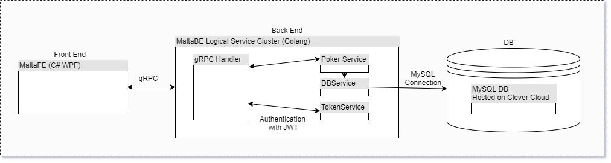

----------------------------------------------------------------------------------
Greetings from ZA! Thank you for giving me the time to show you my coding skills.
----------------------------------------------------------------------------------
I created my backend solutions using a microservice architecture as shown in the file "SystemArchitecture.jpg".

The front end loads a file (Hands.txt) found in the FE directory.

The backend recieves the file via gRPC and calculates the 1000 poker hands with all the statistics of flushes, straights... whatever.
These calls are tokenized calls with JWT security patterns.

The results are saved in a MySQL db stored in the cloud hosted at Clever Cloud.

The FE, BE and DB are in true microservice architecture. The BE is composed of a cluseter of 'logical' microservices that can easily be decoupled into a new microservice.

All microservices are backed with Golangs testing framework. The frame work was implemented with the Poker Service (Poker_test.go)

------------------------
How to run the project?
------------------------
Run the backend first by running the RunBE.sh file.
Run the frontend next by running the RunFE.sh file.
You should see your results in the FE pane and some feedback in the BE.
Feel free to uncheck Authenticate before sending the data to BE. This will send an invalid JWT to the backend making the user unauthorized.

I look forward to working with you guys in future. I chose this architecture as I believe microservices are highly modular and scalable. With the right workflow they are also easy to create.
